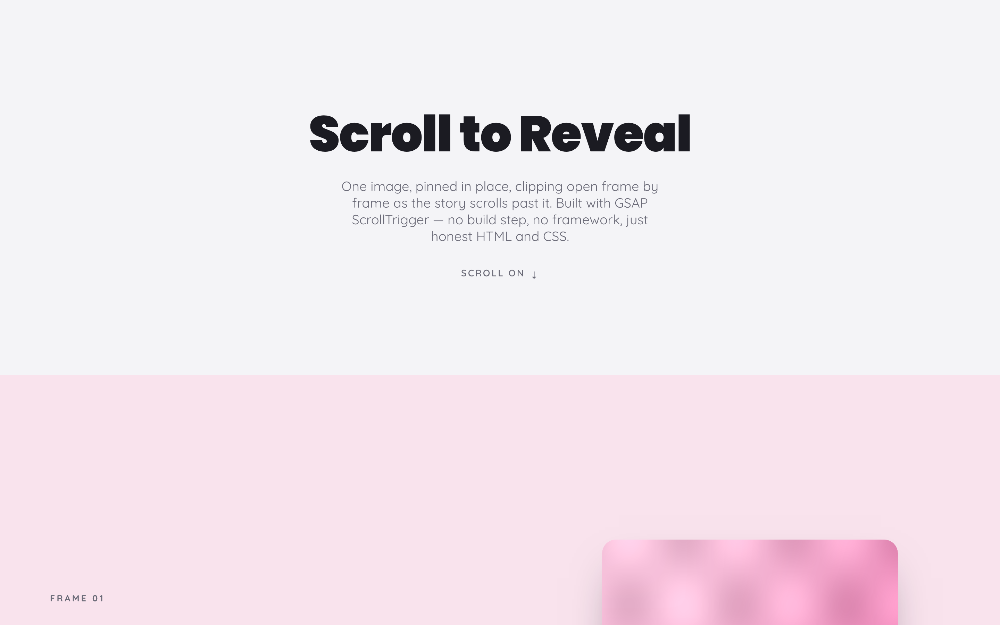
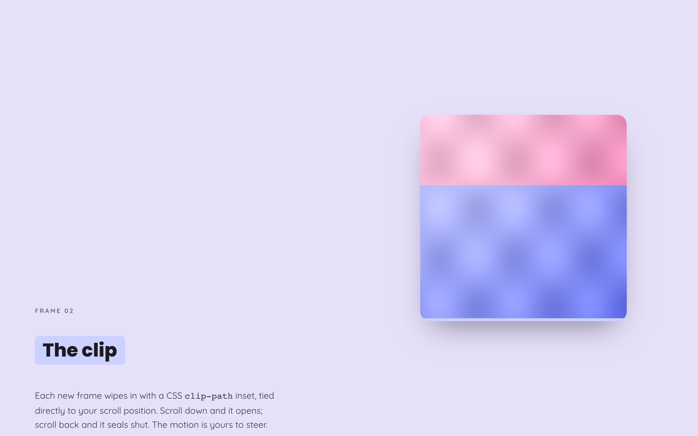
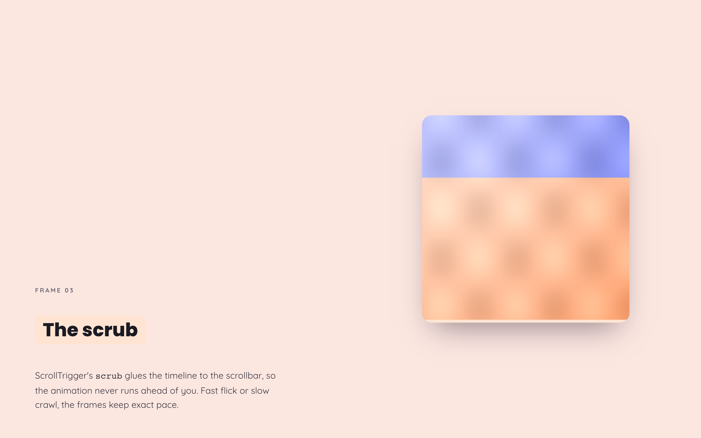
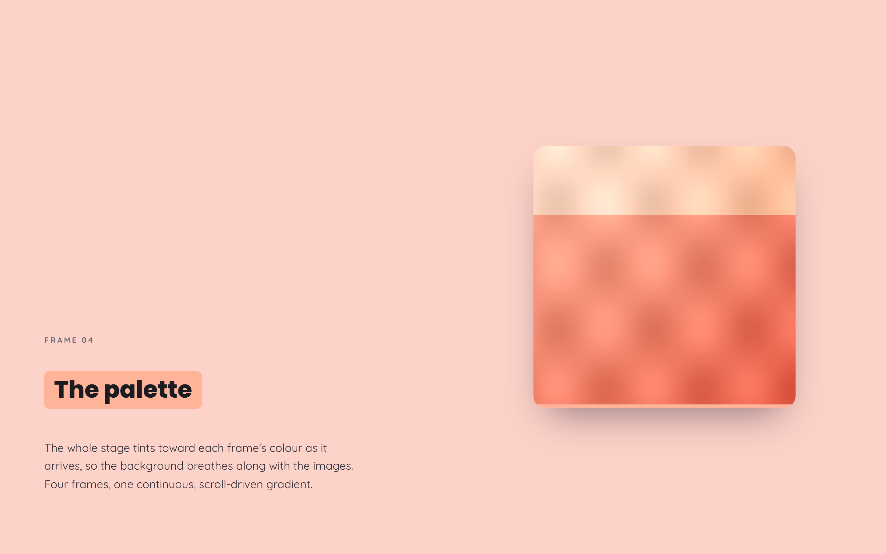
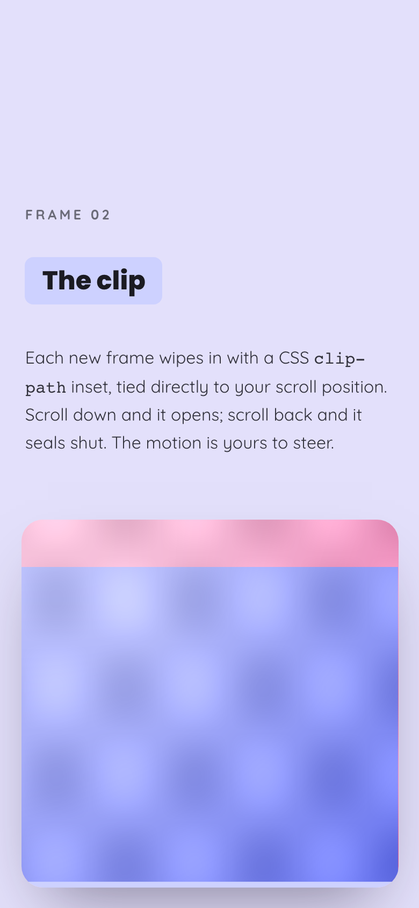

# Pinned Image · Scroll to Reveal ✂️

> One image, pinned dead-centre, **clipping itself open frame by frame** as the page scrolls past. No build step, no framework, no fuss — just honest HTML, a sprinkle of CSS, and [GSAP ScrollTrigger](https://gsap.com/docs/v3/Plugins/ScrollTrigger/) doing the heavy lifting.

Think of it as a flip-book you steer with your scrollbar. Scroll down and each frame wipes into view; scroll back up and it seals shut again. The whole stage even changes colour to match whichever frame is on deck. It's the kind of scrollytelling flourish you've seen on fancy agency sites — here it is, demystified and yours to remix.



---

## ✨ What makes it tick

- **📌 A pin, not a trick.** The artwork locks to the middle of the viewport while the copy keeps scrolling. That stillness is what sells the effect.
- **✂️ Scroll-scrubbed `clip-path`.** Each frame reveals with a CSS inset clip that's wired straight to your scroll position — no autoplay, you're the director.
- **🎨 A background that breathes.** The stage tints toward each frame's colour as it arrives, so the page feels alive end to end.
- **📦 Zero build.** Open `index.html` and it runs. GSAP is vendored locally, the artwork is self-hosted — nothing phones home except Google Fonts.
- **📱 Genuinely responsive.** On phones the image re-pins to the bottom of the screen and the copy stacks above it. No horizontal scrollbars were harmed.
- **♿ Kind to motion-sensitive folks.** Honours `prefers-reduced-motion` — it quietly shows the final frame instead of scrubbing, and there's a graceful fallback if the animation library ever fails to load.

|  |  |  |
|:--:|:--:|:--:|
|  |  |  |

<p align="center">
  
  <br />
  <em>Same magic, pocket-sized.</em>
</p>

---

## 🚀 Get it running (the two-minute version)

You genuinely don't need Node, npm, or a bundler. But a browser won't fetch local files nicely straight off `file://`, so serve the folder over a tiny local web server. Pick whichever you already have:

**Prerequisites:** any modern browser, plus *one* of the tools below (you almost certainly have one already).

```bash
# 1. Grab the code
git clone https://github.com/waleedsworld/pin-img-scroll-clip.git
cd pin-img-scroll-clip
```

```bash
# 2. Serve it locally — choose ONE:

# Python 3 (ships with macOS / most Linux)
python3 -m http.server 7858

# …or Node, if that's more your speed
npx serve .

# …or the VS Code "Live Server" extension — just click "Go Live"
```

```bash
# 3. Open it
#   → http://localhost:7858
```

Now **scroll slowly** through the gallery and watch the frames wipe in. That's the whole show. 🎬

> **Heads up:** opening `index.html` by double-clicking (the `file://` route) works for the layout, but some browsers get grumpy about loading the local scripts. The little web server above sidesteps all of that.

---

## 🧩 How it's built

Everything lives in a single, readable `index.html`:

```
pin-img-scroll-clip/
├── index.html          # the whole app — markup, styles, and the GSAP setup
├── assets/             # four self-hosted gradient "frames"
│   ├── frame-01.png
│   ├── frame-02.png
│   ├── frame-03.png
│   └── frame-04.png
├── vendor/             # GSAP 3.12.2 + ScrollTrigger, vendored (no CDN dependency)
│   ├── gsap.min.js
│   └── ScrollTrigger.min.js
└── docs/media/         # screenshots for this README
```

The core idea in three lines of intent:

1. Every frame after the first starts fully clipped away — `clip-path: inset(100% 0% 0%)`.
2. A GSAP timeline animates them each back to `inset(0% 0% 0%)`, staggered.
3. `ScrollTrigger` **pins** the image and **scrubs** that timeline to your scroll — so scroll position *is* playback position.

Want to make it your own? Swap the four PNGs in `assets/`, rewrite the copy in `index.html`, and tweak the `--col1`…`--col4` CSS variables to match. That's it.

---

## 🎛️ Tweakable knobs

| Want to… | Change this |
|---|---|
| Use your own images | Replace `assets/frame-0*.png` (square-ish works best) |
| Add / remove frames | Add a `.photo` block + a matching `.details` section, then a `tints` entry |
| Speed up / slow down the reveal | The `scrub` value on the pin `ScrollTrigger` (higher = lazier catch-up) |
| Recolour the mood | The `--col1`…`--col4` variables and the `tints` array |

---

## 🌐 Live demo

Deploying soon — a hosted version is on its way. Until then, the two-minute local setup above gets you the full experience.

---

## 📜 Credits & licence

The pinned-image scroll-clip pattern is a well-worn ScrollTrigger technique; this is a clean, self-hosted take on it. All artwork here is generated placeholder gradients and all code is hand-written — nothing third-party is embedded beyond the vendored GSAP library (© GreenSock, used under its standard licence).

Released under the [MIT License](LICENSE) — build cool things with it. 💫
